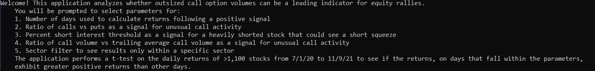
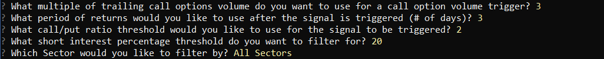
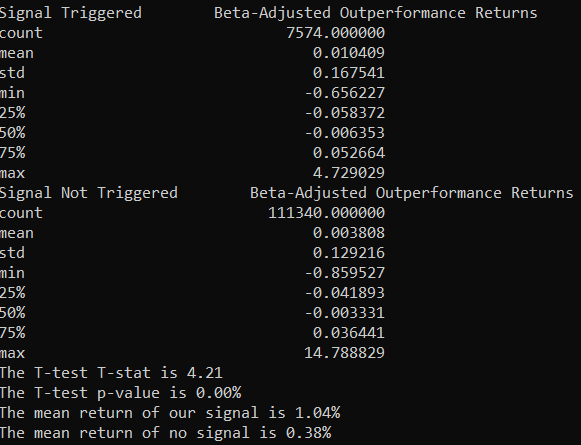
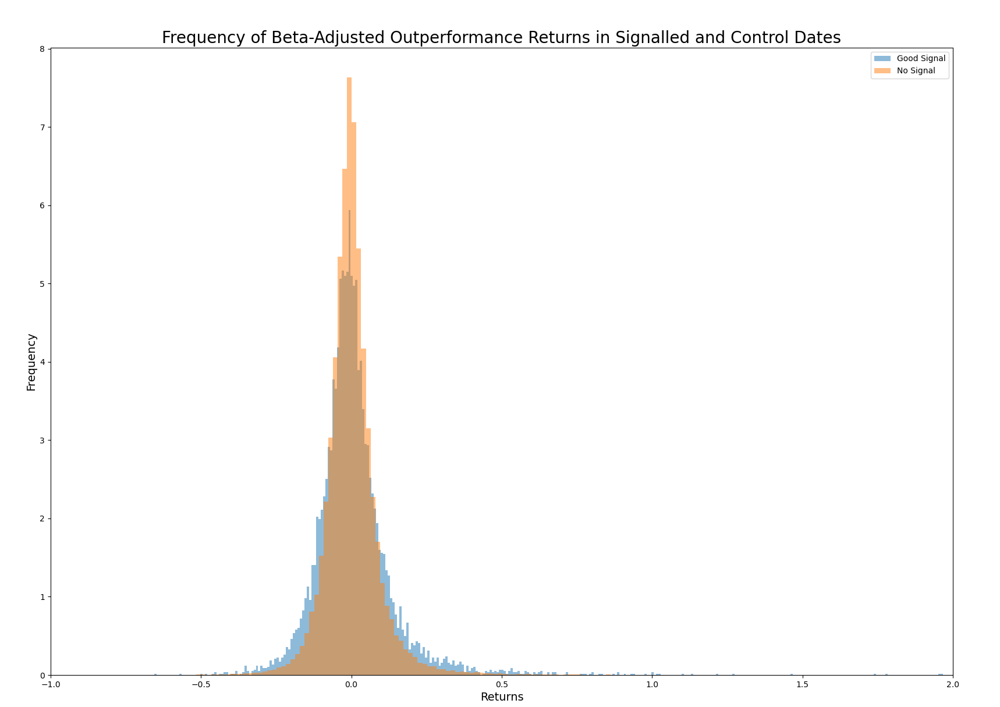

# Analyzing the Impact of Unusual Call Option Volumes on Underlying Stock Price Returns

## Product:
Python-based application designed to identify the impact of unusual call option volumes on subsequent price returns in the underlying stock.  The application features flexible filtering and processing functionality that users can manipulate for various use cases in addition to our own.  

## Objective:
Identify statistically impactful patterns in unusual option volumes, short interest and sector the call/put ratio as predictive indicators for movement in underlying stock prices.

---

## Data:

  - OCC option volume data
  - Bloomberg historical closing stock and option prices

## Technologies:

  - JupyterLab IDE
  - Pandas
  - Numpy
  - Matplotlib
  - Bloomberg API (requires Bloomberg software and terminal access)
  - Fire
  - Questionary

## Installation Guide:
Before running the app, ensure that the libraries above are imported, then install the following dependencies on a command line interface.

  - pip install fire
  - pip install questionary
  - Bloomberg API:
    1. python -m pip install — index-url=https://bloomberg.bintray.com/pip/simple blpapi
    2. python import blpapi

## Usage: To use the application, clone the repository and run **app.py** with:

python app.py

When app.py is opened, the following welcome screen will appear.

A series of prompts will need to be populated with numerical values.

## Data Filtering & Analytical Criteria:

1. Filtering & Screening: Starting with the universe of the top 1200 most heavily optioned stocks on OCC member exchanges, we filter by several criteria to to generate a subset of tickers perceived to be the most likely stocks to be impacted by option flows:

   - Call/Put ratio
   - High Short Interest as a % of free float
   - Ratio of call option volume vs trailing average call option volume (unusual volume filter)
   - Subsequent measurement window expressed as # of trading days 

2. Statistical analysis:   The application performs a t-test on the daily returns of >1,100 stocks from 7/1/20 to 11/9/21 to see if the returns on days that fall within the parameters defined above exhibit greater positive returns than on days the signal was not live.  These groups of data represent our random variable and our control sample.

3. Data visualization:     Histograms, line charts and density plots are generated in matplotlib and hvplot to display the empirical distribution of returns for a stock or group of stocks.  For the sake of our study, we are concerned with all tickers meeting the filter conditions vs the broader market, represented by SPY.  If our hypothesis is accurate, there will be observable right-tail skewness in the distribution of returns for the filtered sample vs the "no signal" sample.  

## Conclusions:
The goal of the application was to allow the user to test and see the results from various combinations of inputs.

That being said, we found some intersting outcomes.  Using heavily shorted names as a filter, our analysis indicated significant results.  Through our T-test, it was clear that increased call option volume was a leading indicator for positive stock returns.  The summary of data indicates that the mean for the signalled returns is clearly higher.  The T-Stat is over 4 and the probabilty that the result is signfiicant is almost 100% (p value close to 0).  Here is a summary of this set of results:

The histogram of results looked like this:

Our results are statistically significant, and the histogram above clearly shows a positive skewness of returns for the "Signal" population with a long right-tailed distribution.
